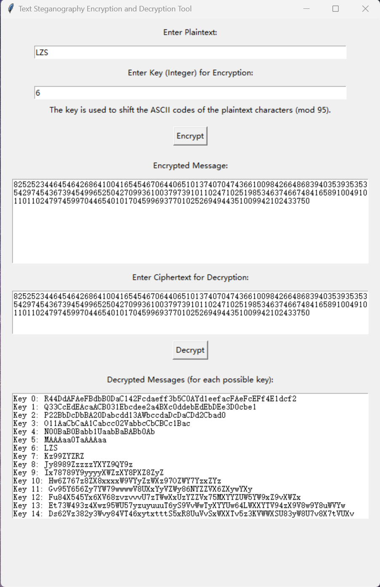
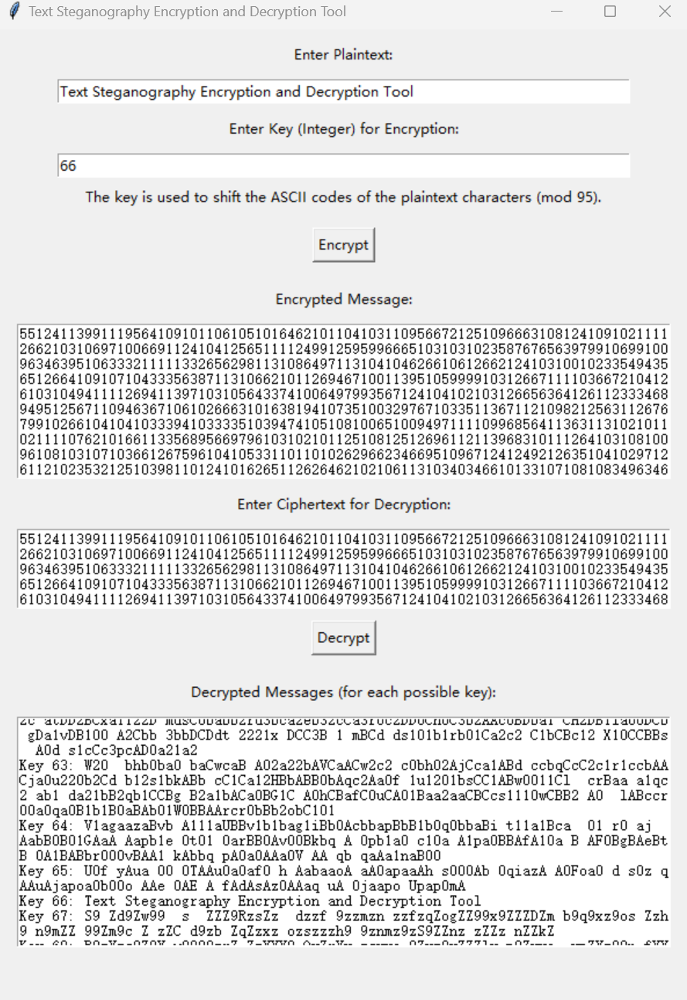

# Text Steganography Encryption and Decryption Tool



## Table of Contents

-   [Overview](#overview)
-   [Features](#features)
-   [How It Works](#how it works)
-   [Installation](#installation)
-   [Screenshots](#screenshots)
-   [Contribution](#contribution)
-   [License](#license)
-   [Acknowledgements](#acknowledgements)
-   [Contact](#contact)

## Overview

Welcome to the **Text Steganography Encryption and Decryption Tool**, an advanced application that integrates steganography with cryptography. This tool allows you to encrypt and decrypt text using an enhanced combination of random symbol insertion, ASCII-based encryption, and numeric transformation of characters. The graphical interface makes it accessible for both beginners and enthusiasts to explore the world of cryptography and steganography.

## Features

- **Steganographic Obfuscation**: Encrypts each character by inserting random symbols, making the encrypted text more challenging to decipher.
- **Key-Based ASCII Encryption**: Encrypts each character by shifting its ASCII value based on a user-defined key, adding an additional layer of security.
- **Numeric Transformation**: Converts encrypted characters into a concatenated numeric string representation of their ASCII values, further obfuscating the message.
- **Dynamic Decryption**: Automatically tries all possible keys and intelligently parses the numeric string back into characters based on two- or three-digit patterns.
- **User-Friendly GUI**: Built with Tkinter, the tool provides a simple and intuitive interface for performing encryption and decryption.

## How It Works

### Encryption

1. **Insert Random Symbols**: For each character in your message, the tool inserts a random string of non-alphanumeric symbols. This step helps to obfuscate the actual content by mixing in irrelevant characters.
  
2. **Apply ASCII Shift**: Using a numeric key provided by the user, the tool shifts the ASCII value of each character and the inserted random symbols. This is done modulo 95 to ensure all characters remain within the visible ASCII range (32–126).

3. **Convert to Numeric ASCII Values**: After the shift, each character's new ASCII value is converted to its numeric string representation using `ord()`. The resulting numbers are concatenated directly without any spaces, enhancing the encryption by making the ciphertext look like a continuous stream of digits.

### Decryption

1. **Parse Numeric String**: During decryption, the tool attempts to parse the numeric string into two- or three-digit ASCII values. If the first digit is '1', the tool assumes it is a three-digit ASCII value (100-126). Otherwise, it treats it as a two-digit ASCII value (32-99).

2. **Reverse ASCII Shift**: The tool tries all possible keys by reversing the ASCII shift for the parsed characters, converting them back from their numeric form into readable text.

3. **Filter Non-Alphanumeric Symbols**: After the reverse shift, the tool filters out the random non-alphanumeric symbols that were inserted during encryption, revealing the potential decrypted messages.

4. **Brute Force All Keys**: The tool tries all possible key values (0 to 94), listing each possible decryption attempt. This allows the user to visually identify the correct decrypted message based on the original plaintext.

## Installation

To run the Text Steganography Encryption and Decryption Tool, follow these steps:

1. **Clone the Repository**:

    ```bash
    git clone https://github.com/CARL-JOSEPH-LEE/Text-Steganography-Encryption-and-Decryption-Tool.git
    ```

2. **Navigate to the Project Directory**:

    ```bash
    cd Text-Steganography-Encryption-and-Decryption-Tool
    ```

3. **Run the Program**: Execute the Python script using:

    ```bash
    python main.py
    ```

## Screenshots


## Why Use This Tool?

In today’s world, where privacy and security are paramount, this tool offers a sophisticated yet accessible method for securing your text. The combination of steganography, cryptography, and numeric obfuscation provides a robust approach to encrypting sensitive information. Whether you’re exploring encryption for educational purposes or seeking real-world applications, this tool gives you a practical experience in understanding and using encryption technologies.

## Contribution

Contributions are always welcome! Feel free to fork the repository, submit issues, or create pull requests to improve the functionality and security of the tool. Let’s work together to make cryptography more accessible and powerful.

## License

This project is licensed under the MIT License - see the LICENSE file for more details.

## Acknowledgements

-   The [Tkinter](https://docs.python.org/3/library/tkinter.html) library for creating the graphical user interface.
-   The [random](https://docs.python.org/3/library/random.html) module for generating random symbols for text encryption.
-   The [ASCII](https://en.wikipedia.org/wiki/ASCII) character encoding standard for character shifting and obfuscation in the encryption process.
-   The [messagebox](https://docs.python.org/3/library/tkinter.messagebox.html) module from Tkinter for displaying error messages and user prompts.

## Contact

For any questions, suggestions, or feedback:

- **GitHub**: [CARL-JOSEPH-LEE](https://github.com/CARL-JOSEPH-LEE)
- **Email**: carljosephlee3@gmail.com

[](https://github.com/anuraghazra/github-readme-stats)

[](https://git.io/streak-stats)


